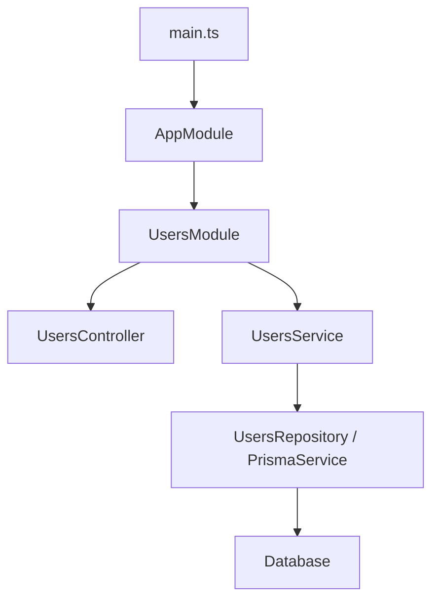

# Как читать NestJS проект новичку?

> [!NOTE]
> Чтобы не потеряться в NestJS-проекте, начинай не с отдельных decorators, а с пути приложения: `main.ts` запускает `AppModule`, `AppModule` подключает feature modules, modules связывают controllers и providers, controller принимает request, service выполняет use case.

## Первый маршрут по проекту

Открой файлы в таком порядке:

1. `src/main.ts`
2. `src/app.module.ts`
3. нужный feature module, например `src/users/users.module.ts`
4. controller, например `users.controller.ts`
5. service, например `users.service.ts`
6. DTO, repository, entity или Prisma/TypeORM слой

## Как думать о NestJS

## Что искать в каждом файле

| Файл | Что искать |
|---|---|
| `main.ts` | global pipes, CORS, prefix, Swagger, listen |
| `app.module.ts` | какие modules подключены |
| `*.module.ts` | controllers, providers, imports, exports |
| `*.controller.ts` | routes и DTO |
| `*.service.ts` | use cases и бизнес-логика |
| `dto/*.dto.ts` | входные контракты и validation |

## Мини-шпаргалка

- Не начинай с service, сначала найди module.
- `main.ts` показывает глобальные настройки.
- `AppModule` показывает карту приложения.
- Feature module показывает локальную карту фичи.
- Controller почти всегда ведет к service.
